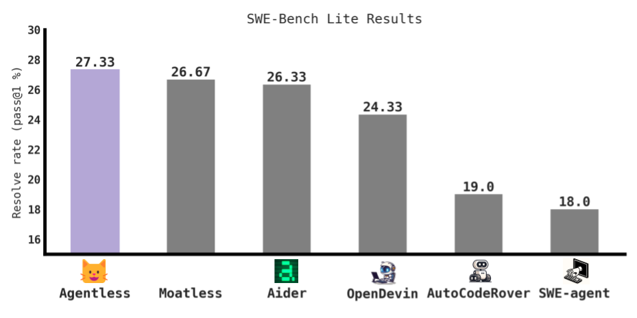

# 😺 Agentless

<p align="center">
    <a href="https://arxiv.org/abs/2407.01489"></a>
    <a href="https://github.com/OpenAutoCoder/Agentless/blob/master/LICENSE"></a>
</p>

<p align="center">
    <big><a href="#-news">😽News</a></big> |
    <big><a href="#-setup">🐈Setup</a></big> |
    <big><a href="#-comparison">🧶Comparison</a></big> | 
    <big><a href="#-artifacts">🐈‍⬛Artifacts</a></big> |
    <big><a href="#-citation">📝Citation</a></big> |
    <big><a href="#-acknowledgement">😻Acknowledgement</a></big>
</p>

## 😽 News 

- *Dec 2nd, 2024*: We integrated Agentless with Claude 3.5 Sonnet to achieve 40.7% and 50.8% solve rate on SWE-bench lite and verified 
- *Oct 28th, 2024*: We just released OpenAutoCoder-Agentless 1.5! 
- *July 1st, 2024*: We just released OpenAutoCoder-Agentless 1.0! **Agentless** currently is the best open-source approach on SWE-bench lite with 82 fixes (27.3%) and costing on average $0.34 per issue.

## 😺 About 

**Agentless** is an *agentless* approach to automatically solve software development problems. To solve each issue, **Agentless** follows a simple three phase process: localization, repair, and patch validation.
- 🙀 **Localization**: Agentless employs a hierarchical process to first localize the fault to specific files, then to relevant classes or functions, and finally to fine-grained edit locations
- 😼 **Repair**: Agentless takes the edit locations and samples multiple candidate patches per bug in a simple diff format
- 😸 **Patch Validation**: Agentless selects the regression tests to run and generates additional reproduction test to reproduce the original error. Using the test results, Agentless re-ranks all remaining patches to selects one to submit

## 🐈 Setup

First create the environment 

```shell
git clone https://github.com/OpenAutoCoder/Agentless.git
cd Agentless

conda create -n agentless python=3.11 
conda activate agentless
pip install -r requirements.txt
export PYTHONPATH=$PYTHONPATH:$(pwd)
```

<details><summary>⏬ Developer Setup</summary>
<div>

```shell
# for contribution, please install the pre-commit hook.
pre-commit install  # this allows a more standardized code style
```

</div>
</details>

Then export your OpenAI API key 
```shell
export OPENAI_API_KEY={key_here}
```

Now you are ready to run **Agentless** on the problems in SWE-bench! 

> [!NOTE]
> 
> To reproduce the full SWE-bench lite experiments and follow our exact setup as described in the paper. Please see this [README](https://github.com/OpenAutoCoder/Agentless/blob/main/README_swebench.md)

## 🧶 Comparison

Below shows the comparison graph between **Agentless** and the best open-source agent-based approaches on SWE-bench lite

<p align="center">

</p>

## 🐈‍⬛ Artifacts

You can download the complete artifacts of **Agentless** in our [v1.5.0 release](https://github.com/OpenAutoCoder/Agentless/releases/tag/v1.5.0):
- 🐈‍⬛ agentless_swebench_lite: complete Agentless run on SWE-bench Lite
- 🐈‍⬛ agentless_swebench_verified: complete Agentless run on SWE-bench Verified
- 🐈‍⬛ swebench_repo_structure: preprocessed structure information for each SWE-Bench problem

You can also checkout `classification/` folder to obtain our manual classifications of SWE-bench-lite as well as our filtered SWE-bench-lite-*S* problems.

## 📝 Citation

```bibtex
@article{agentless,
  author    = {Xia, Chunqiu Steven and Deng, Yinlin and Dunn, Soren and Zhang, Lingming},
  title     = {Agentless: Demystifying LLM-based Software Engineering Agents},
  year      = {2024},
  journal   = {arXiv preprint},
}
```

> [!NOTE]
> 
> The first two authors contributed equally to this work, with author order determined via [*Nigiri*](https://senseis.xmp.net/?Nigiri)

## 😻 Acknowledgement 

* [SWE-bench](https://www.swebench.com/)
* [Aider](https://github.com/paul-gauthier/aider)
* [SWE-bench-docker](https://github.com/aorwall/SWE-bench-docker)
